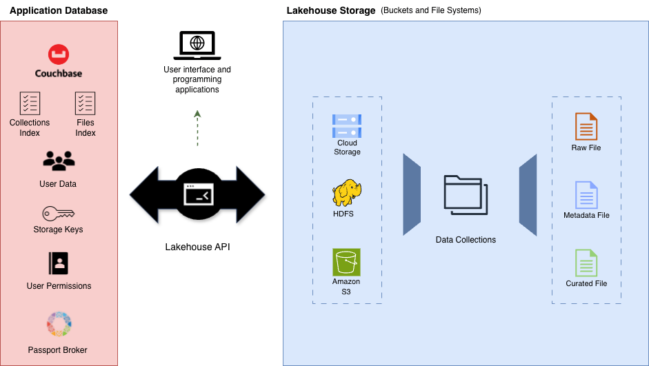

# Lakehouse Platform (OpenHealthLake)

This lakehouse platfrom is fully open-source and adaptable. It was built to help low-resourced research groups and health initiatives on addressing the challenges adhered from heterogeneous data management, data sharing and data governance. It was implemented as part of a MSc in Computer Science project, supported by the [INFORM Africa Research Study Group](https://inform-africa.org/).

It is important to highlight that this is a prototype platform which is still under development. Currently, it can be used as a supplementary tool to support data storage, data sharing, and data governance. Efforts to implement tools to support workflows and analytical processing analysis will be put in to expant this platform in the near future.


## Platform Structure

This first prototype platform's design is based on the data lakehouse architecture, adapted to focus on data storage and governance. The design comprised three main components: _Data Storare_, _Application Database_, and a _Application API_ (as shown in the Diagram below).



The data storage component supports three storage environments, including Google Cloud Storage, Amazon S3 and Apache HDFS. The physical files are grouped in dataset collections (folders or repositories of files) and stored in these environments. The platform supports the distinction between raw and processed files. The access is granted at a collection level, which means that data owners can create collections with one or multiple files and grant extarnal users access to their collections.

The application database component stores all data necessary to control the platform's execution flow and governance, including user data, permission data, external storage environment access keys and the data catalogue (which comprises a list of physical files and a list of collections). This database is implemented with the Non-relational database Couchbase, which is easy to set up, and to scale up and down. Couchbase can be installed using docker containers and provides flexibility to adapt to different computational environments, ranging from single cluster to multicluster environments.

Lastly, the application API controls the execution flow of funtionalities, besides encapsulating the application core business logic such as authentication, access control, data uploading, data downloading, and data versioning. It can be accessed by external services and by additional Python ([see documentation](https://github.com/danilo-dcs/lakehouse-python-package)) and R ([see documentation](https://github.com/danilo-dcs/lakehouse-R-package)) libraries built to support interoperability from user's runtime environments.


## Platform/Repository Access Index

- [Lakehouse API Code](./backend/)
- [Lakehouse Web Interface Code](./frontend/)
- [Couchbase Set Up Codes](./couchbase/)
- [Hadoop Set Up Codes](./hadoop/)


## Docker Set Up Steps

Create the docker_volumes folder, under the $HOME dir:

```
mkdir $HOME/docker_volumes
```

Setting user permissions to the volume's folder:

```
sudo chown -R $USER:$USER $HOME/docker_volumes && sudo chmod -R 755 $HOME/docker_volumes
```

Make sure to install NGINX following the set up steps specified on the nginx folder: [link](./nginx/README.md)

## Lauching as Standalone Platform

1. Make sure to create the `.env` file in the root directory, following the `.env.example` file (also in the root directiory).

This file contains important variables for the backend api and the frontend applications.

2. Run the command below:
```
docker-compose up -d --build
```
